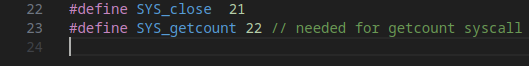

# Kernel Hacking

## Summary

For this project, we implemented our own system call to the xv6 kernel. With this system call, `sys_getcount()`, the user can view the number of specific system call that have been called by processes since the time that the kernel was booted.

## Design choises

In order to be able to get the system call count of multiple different syscalls, we decided to implement some logic to the `syscall` function in `kernel/syscall.c`. The array `syscall_counts` contains 22 entries set to 0 and each time some syscall is called via the `syscall` function, the number of calls on that syscall is incremented.


The `sys_getcount()` system call implemented into the `kernel/sysfile.c` file. With this syscall, the number of syscalls for different syscalls can be returned to the user. Also, there is an option to reset the counter.


The cli command `getcount` logic is in `user/getcount.c` (not all in the picture below). User has option between 5 different syscalls. With simple coding, more syscalls can be easily added to this code, other files do not need changes.


Define the syscall in `kernel/syscall.h`:



Define the syscall command in `user/usys.pl` for the cli:


Define the `getcount` function in `user/user.h`:


Add the command to `Makefile`;


## Compiling and Running

Information about using xv6-riscv [here](https://github.com/mit-pdos/xv6-riscv)

Run the following commands inside `/kernel-hacking/xv6-riscv`, the command `make qemu` command will boot the xv6 kernel

```
make clean
make
make qemu
```

Then run command `getcount`, the following usage information is printed:

```
Usage: getcount [syscall] [reset]
Syscall options to count:
5 - read
16 - write
15 - open
21 - close
22 - getcount
Reset option: 1 to reset the count, 0 to keep it (default)
```

## Examples

Below you can see example use of the `getcount` command


## Points requested

| Requirement                                                                               | Points | Status                               |
| ----------------------------------------------------------------------------------------- | ------ | ------------------------------------ |
| Everything submitted compiles and works at least on some level                            | 2      | Done                                 |
| The documentation is detailed, and the provided source code is reasonably well commented. | 1      | Done                                 |
| You can reset the counter with an argument                                                | 1      | Done                                 |
| You can select between the number of different system call which to follow                | 1      | Done, 5 different syscalls available |
| **Total**                                                                                 | **5**  |
