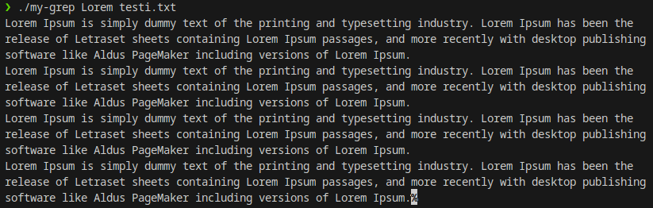
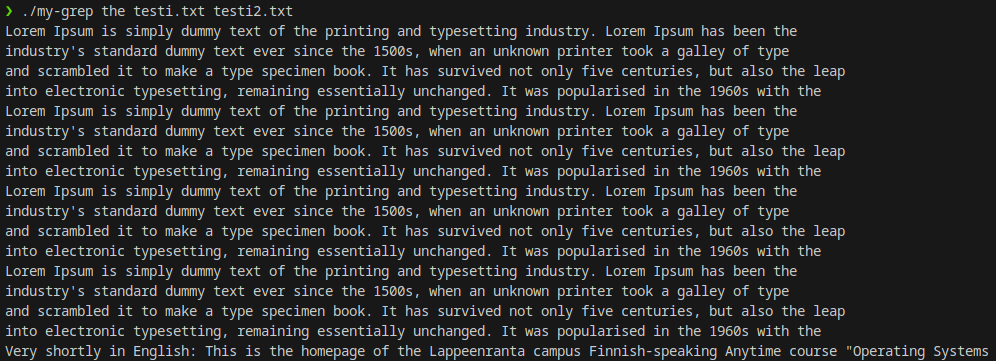
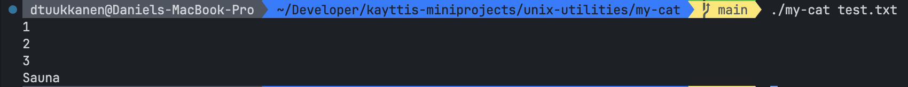
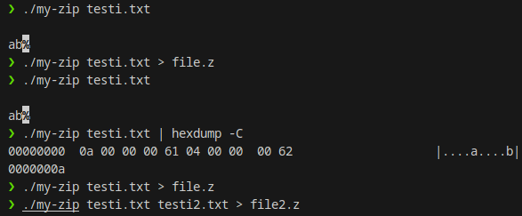
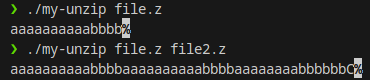

# Unix Utilities

## Summary

In this project, we built a few different simple versions of commonly used UNIX utiliy commands: cat, grep, zip and unzip.

## Compiling and Running

### `my-cat`:

In the `my-cat` directory, run command to compile:

```
gcc my-cat.c -o my-cat -Wall -Werror
```

Run program with

```
./mycat test.txt
```

### `my-grep`:

In the `my-grep` directory run command

```
gcc -o my-grep -Wall -Werror my-grep.c
```

Usage:

```
my-grep: searchterm [file ...]
```

### `my-zip`:

In the `my-zip` directory run command 

```
gcc -o my-zip -Wall -Werror my-zip.c
```
Usage:

```
my-zip: file1 [file2 ...]
```

### `my-unzip`:

In the `my-unzip` directory run command 

```
gcc -o my-unzip -Wall -Werror my-unzip.c
```
Usage:

```
my-unzip: file1 [file2 ...]
```

## Examples

### `my-grep`:




### `my-cat`:




### `my-zip` and `my-unzip`

In the picture below, is the my-zip. In our opinion the instructions for it were a bit confusing as to how the each stdout should be show but this is what we came up with. The `%`in the end of the output comes from unix end of line so it should not be considered. The command `./my-zip testi.txt | hexdump -C` shows the true hex form of the output of the `my-zip`. In the hexdump the part that really matters is the `0a 00 00 00 61 04 00 00 00 62` which translates to 10a4b (`0a 00 00 00` = 10, `61` = a, `04 00 00 00` = 4 and `62` = b). Everything else in the output are just hexdump command 'extras'. To see raw hex form user can try command `./my-zip testi.txt | xxd -p`




## Points requested

| Requirement                                                                               | Points | Status |
| ----------------------------------------------------------------------------------------- | ------ | ------ |
| Everything submitted compiles and works at least on some level.                           | 1      | Done   |
| The documentation is detailed, and the provided source code is reasonably well commented. | 1      | Done   |
| my-cat works as instructed                                                                | 1      | Done   |
| my-grep works as instructed                                                               | 1      | Done   |
| my-zip and my-unzip works as instructed                                                   | 1      | Done   |
| **Total**                                                                                 | **5**  |
