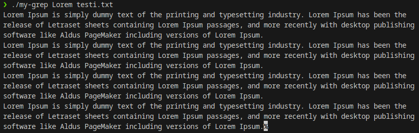
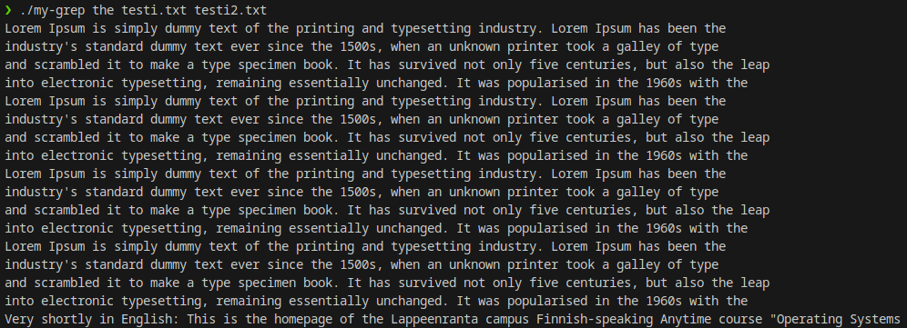

# Unix Utilities

## Summary

In this project, we built a few different simple versions of commonly used UNIX utiliy commands: cat, grep, zip and unzip.

## Compiling and Running

### `my-cat`:

In the `my-cat` directory, run command to compile:

```
gcc my-cat.c -o my-cat -Wall -Werror
```

Run program with

```
./mycat test.txt
```

### `my-grep`:

In the `my-grep` directory run command

```
gcc -o my-grep -Wall -Werror my-grep.c
```

Usage:

```
my-grep: searchterm [file ...]
```

## Examples

### `my-grep`:




## Points requested

| Requirement                                                                               | Points | Status |
| ----------------------------------------------------------------------------------------- | ------ | ------ |
| Everything submitted compiles and works at least on some level.                           | 1      | Done   |
| The documentation is detailed, and the provided source code is reasonably well commented. | 1      | -      |
| my-cat works as instructed                                                                | 1      | Done   |
| my-grep works as instructed                                                               | 1      | Done   |
| my-zip and my-unzip works as instructed                                                   | 1      | Done   |
| **Total**                                                                                 | **5**  |
