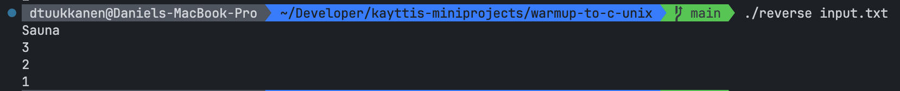

# Warmup to C and UNIX programming

## Summary

For this project, we implemented a command-line utility called `reverse` that reads text from an input source and outputs the lines in reverse order. The program handles three different usage scenarios:

1. `./reverse` - Reads from standard input and prints to standard output
2. `./reverse input.txt` - Reads from the specified input file and prints to standard output
3. `./reverse input.txt output.txt` - Reads from the specified input file and writes to the specified output file

## Design choices

- We chose to use linked list since it is the best way to dynamically allocate memory. Linked list also makes it easy to reverse, especially when file is read and last read line is also the tail (last node) and therefore can be traversed from tail to head because of the data structure.

- Instead of reading lines by allocating fixed-size buffers (e.g., limiting line length to 1024 characters) or character by character, we used the `getline()` function which dynamically allocates memory for lines of any length.

## Assumptions and Errors

- Input is the same as output: Prints "Input and output file must differ" and exits with return code 1.
- String length: Gets line with `getline()` and it is not restricted by length.
- File length: Reads file within `while` loop with `getline()` until error or end-of-file is reached.
- Invalid files: If file opening fails it prints `error: cannot open file '%s'\n` and exits with error code 1.
- Malloc fails: code uses `fprintf(stderr, "malloc failed\n")` and exits with return code 1.
- Too many arguments passed to program: notifies user with `fprintf(stderr, "usage: reverse <input> <output>\n");` and exits with code 1.
- How to print error messages: every error message is printed with e.g. `fprintf(stderr, error_message)`

## Compiling and Running

**While in the warmup-to-c-unix folder:**

```
gcc reverse.c -o reverse -Wall -Werror
```

**General usage:**

```
./reverse <input> <output>
```

where input and output are optional (expect input must be given if output is given)

**Usage with stdin:**

```
./reverse
```

**Usage with input file**

```
./reverse input.txt
```

**Usage with input and output file**

```
./reverse input.txt output.txt
```

## Examples

Input file contents (named as `input.txt` in examples):

```
1
2
3
Sauna
```

Compile:


Run without parameters:


Run with input parameter:


Run with input and output parameter:


Result to output:


## Points requested

| Requirement                                                                              | Points |
| ---------------------------------------------------------------------------------------- | :----: |
| Everything submitted compiles and works at least on some level.                          |   1    |
| The documentation is appropriate, correct and the repository is available                |   0    |
| The documentation is detailed, and the provided source code is reasonably well commented |   1    |
| All additional assumptions                                                               |   1    |
| Errors mentioned are addressed                                                           |   2    |
| **Total**                                                                                | **5**  |
